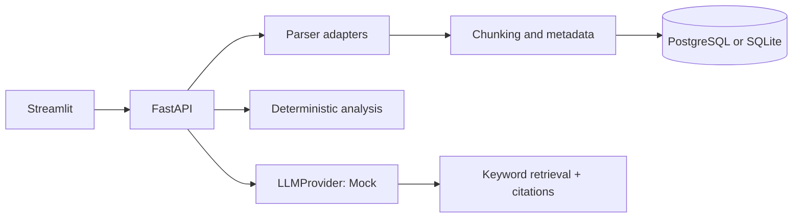

# AI Document Intelligence & Editor

**Status: Runnable portfolio implementation with deterministic mock mode**

**Portfolio status: Runnable implementation with deterministic mock mode**

Runnable portfolio implementation of an evidence-oriented document workspace. It uploads PDF, DOCX, TXT, and Markdown files, parses them through an adapter, chunks and stores source metadata, analyzes content, answers questions with citations, proposes AI edits without overwriting text, preserves versions, and produces deterministic version diffs.

**Status:** runnable portfolio implementation. **Synthetic Data:** the sample document and evaluation set are synthetic. **Mock Integrations:** the default LLM is deterministic and does not require an API key.

## Architecture



The request flow is upload -> parse -> chunk -> persist -> analyze or retrieve -> return validated Pydantic output. Deterministic code handles parsing, chunking, metadata, extraction heuristics, and diffs. The provider boundary is where an OpenAI implementation can be added without changing the API.

## Features

- Upload validation by extension, size, and extractable text
- PDF, DOCX, TXT, and Markdown parser adapter
- Executive summary, key points, decisions, action items, risks, missing information, and potential contradictions
- Grounded Q&A with source quote, chunk ID, and confidence
- Reviewable rewrite suggestions: improve, professional, shorten, expand, bullets, summarize, heading, explain
- Immutable version history and deterministic unified diffs
- Request IDs, structured errors, health endpoint, SQLite local mode, PostgreSQL Docker mode
- Pytest smoke tests and a synthetic evaluation runner

## Run Locally

```powershell
python -m venv .venv
.venv\Scripts\Activate.ps1
pip install -r requirements.txt
uvicorn app.main:app --reload
```

Open `http://localhost:8000/docs` for OpenAPI and run the UI in another terminal:

```powershell
streamlit run frontend/streamlit_app.py
```

Use `MOCK_MODE=true` for no-key demos. Copy `.env.example` to `.env` to customize settings.

## Docker

```powershell
docker compose up --build
```

API: `http://localhost:8000/docs`. UI: `http://localhost:8501`.

## API Examples

```powershell
curl -F "file=@data/sample_documents/customer_migration_plan.txt" http://localhost:8000/api/v1/documents/upload
curl -X POST http://localhost:8000/api/v1/documents/1/analyze
curl -X POST http://localhost:8000/api/v1/documents/1/ask -H "Content-Type: application/json" -d '{"question":"What database is selected?"}'
```

## Tests and Evaluation

```powershell
python -m pytest -q
python -m evaluation.run_evaluation
```

The evaluation reports synthetic term recall only; it does not claim summary quality, groundedness, latency, or hallucination performance. A production evaluation should add labeled datasets, citation entailment, retrieval precision/recall, human review, and latency/cost measurements.

## Security and Limitations

Document text is treated as data by the mock provider and is never used as a system instruction. Secrets belong in environment variables. The sample has an authorization-ready document ID boundary, but authentication, per-user authorization, malware scanning, asynchronous workers, a real vector index, and production LLM integration still need to be added before deployment.

## Interview Notes

The strongest design choice is the split between deterministic and probabilistic work: parsers, chunking, metadata, validation, version diffs, and citation selection are deterministic; semantic rewriting and analysis can be delegated behind an `LLMProvider`. RAG reduces unsupported answers by restricting context and returning the exact evidence used. Scaling would add object storage, a queue, worker processes, pgvector or a managed vector store, caching, tenant authorization, and observability around latency, token cost, retrieval quality, and failure rates.

## Honest Resume Bullets

- Built a FastAPI and Streamlit document intelligence workspace with PDF, DOCX, TXT, and Markdown ingestion, structured Pydantic analysis, and immutable document versions.
- Implemented evidence-oriented question answering with chunk metadata, source quotes, confidence, and deterministic retrieval in mock mode.
- Added reviewable AI editing operations, deterministic version comparison, upload validation, request IDs, Docker configuration, and pytest coverage.
- Created a synthetic evaluation runner for answer term recall and documented production limitations and scaling considerations.

## Resume Relevance

Demonstrates FastAPI, Streamlit, document parser adapters, chunking, metadata, grounded retrieval, citations, Pydantic outputs, version diffs, Docker, PostgreSQL readiness, and pytest-based smoke coverage.

## Author and Related Work

**Sunil Javadi** · [GitHub](https://github.com/suniljavadi) · [Portfolio](https://github.com/suniljavadi/sunil-portfolio) · [LinkedIn](https://www.linkedin.com/in/sunil-javadi/)

- [AI Document Intelligence and Editor](https://github.com/suniljavadi/ai-document-intelligence-editor)
- [Enterprise RAG Knowledge Assistant](https://github.com/suniljavadi/Enterprise-RAG-Confluence-Knowledge-Assistant)
- [Enterprise RAG Meeting Intelligence Agent](https://github.com/suniljavadi/Enterprise-RAG-Meeting-Intelligence-Agent)

## Local Git Workflow

```powershell
git add .
git commit -m "Document AI workspace"
git push origin main
```
